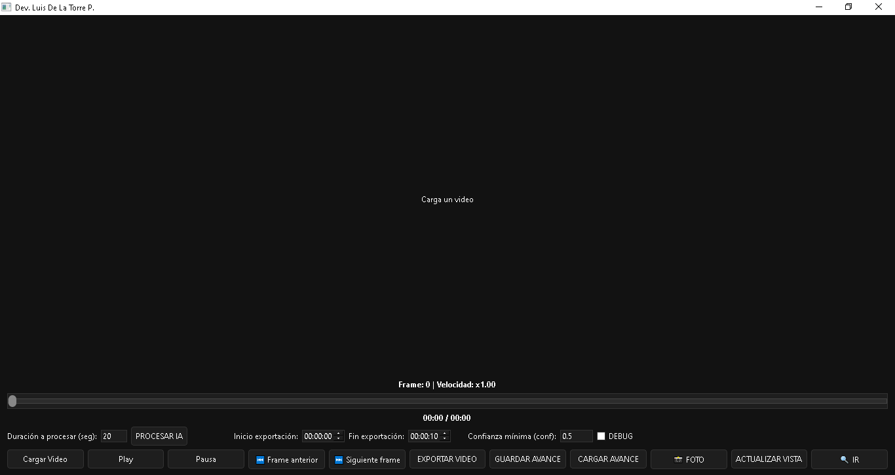
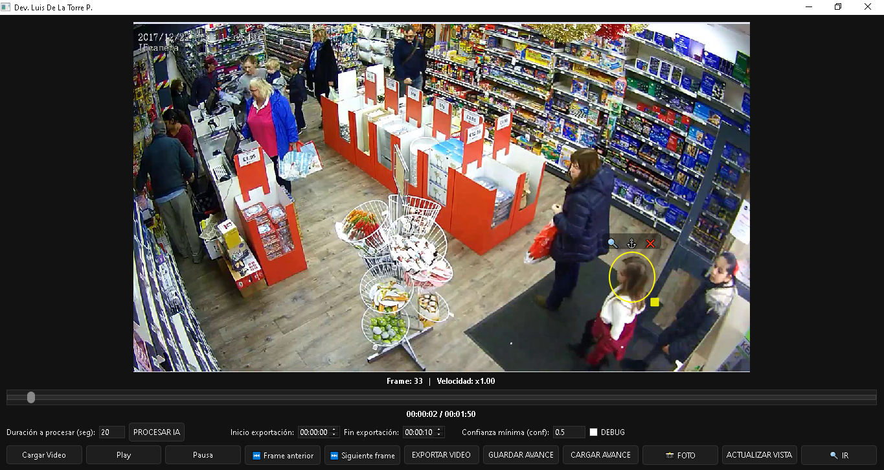
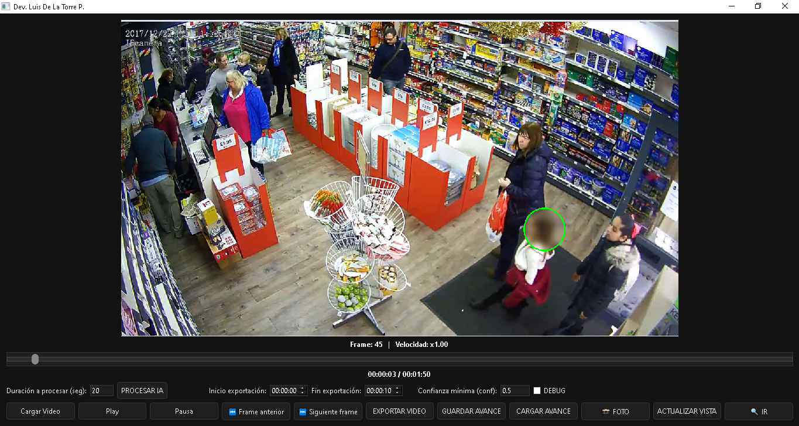

# Video Blur Editor (YOLOv8 + OpenCV)

Aplicación en Python para detectar rostros y aplicar difuminado automático o manual en videos utilizando modelos de visión artificial.

El programa permite revisar videos, detectar personas o rostros y exportar el video final con las zonas difuminadas para proteger la identidad o privacidad.

El proyecto utiliza **YOLOv8** para detección de objetos y **OpenCV** para el procesamiento de video.

---

# Captura de la aplicación

---

# Características

* Detección de rostros usando **YOLOv8**
* Difuminado automático de rostros en video
* Difuminado manual seleccionando zonas
* Procesamiento de video con OpenCV
* Exportación de video en múltiples resoluciones
* Interfaz gráfica desarrollada en Python
* Compatible con **GPU AMD mediante DirectML**
* Sistema de exportación optimizado con FFmpeg

---

# Demo

---

# Tecnologías utilizadas

* Python
* YOLOv8
* OpenCV
* PyTorch
* FFmpeg

---

# Requisitos del sistema

* Python **3.10.11**
* **FFmpeg** instalado en el sistema

---

# Instalación

## 1 Clonar el repositorio

git clone https://github.com/luisdl-dev/videoeditor-difuminador

Entrar a la carpeta del proyecto:

cd videoeditor-difuminador

---

## 2 Instalar dependencias

pip install -r requirements.txt

---

## 3 Resolver conflictos de OpenCV

Después de instalar dependencias, eliminar posibles conflictos de versiones:

python -m pip uninstall -y opencv-python opencv-contrib-python opencv-python-headless
python -m pip uninstall -y numpy

Instalar versiones compatibles:

python -m pip install numpy==1.26.4
python -m pip install opencv-contrib-python==4.7.0.72

---

## 4 Modo GPU (AMD / DirectML)

Solo si se tiene tarjeta **AMD dedicada**:

pip install torch-directml

---

# Instalar FFmpeg en Windows

1 Descargar FFmpeg:

https://ffmpeg.org/download.html

2 Extraer o instalar en:

C:\ffmpeg

3 Agregar al **PATH de Windows**:

C:\ffmpeg\bin

---

# Ejecutar la aplicación

Desde la carpeta del proyecto ejecutar:

python src/main.py

Esto abrirá la interfaz gráfica del editor de video.

---

# Posibles usos

* Protección de identidad en videos
* Difuminado de rostros en grabaciones
* Edición rápida de videos de seguridad
* Procesamiento automático de material audiovisual

---

# Autor

Luis de la Torre Palomino

Desarrollador autodidacta interesado en visión por computadora, automatización y herramientas basadas en inteligencia artificial.

GitHub:
https://github.com/luisdl-dev
